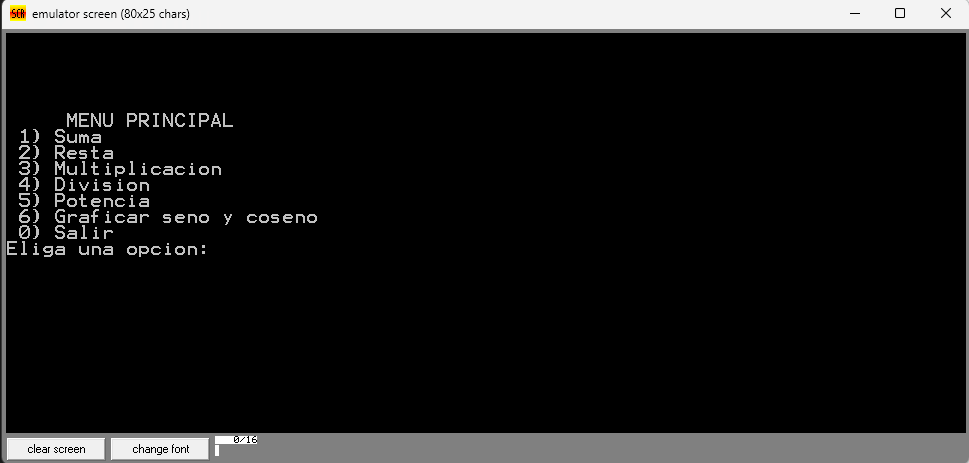
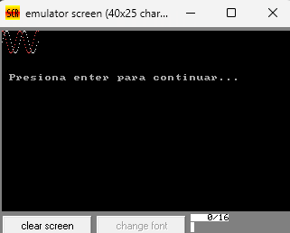

# CALCULADORA EN ENSAMBLADOR PARA INTEL 80X86
Proyecto de la materia traductores de lenguajes.

## DESCRIPCIÓN
Se creó una calculadora que efectua las operaciones basicas cómo suma, resta, multiplicación, división. Así cómo también potencia y la opción de graficar de seno y coseno.

## IMAGENES DEL PROGRAMA

### Interfaz

### Grafica seno y coseno
